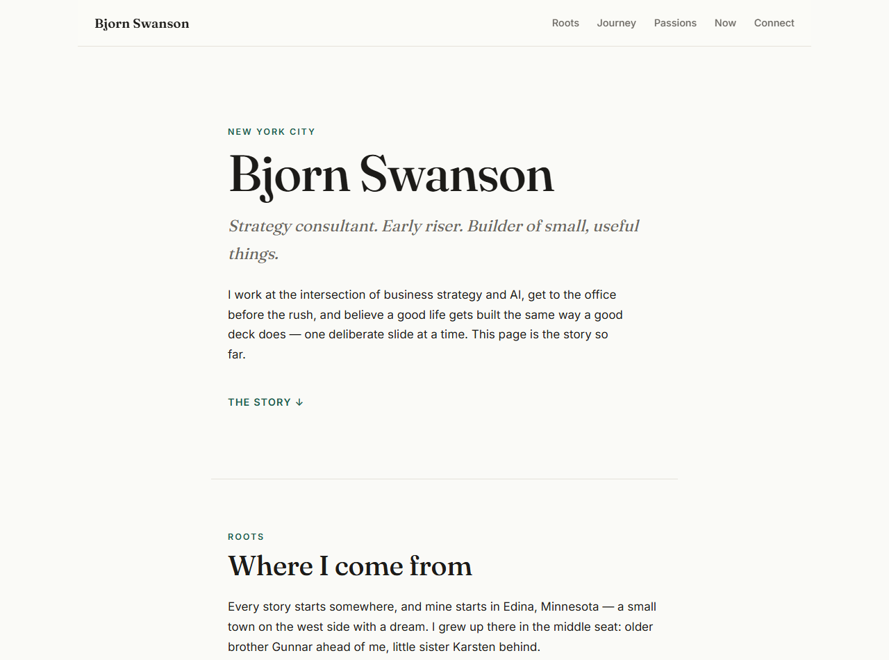

# bjornswanson0.github.io

**Live site: [bjornswanson0.github.io](https://bjornswanson0.github.io/)**

My personal corner of the internet: where I'm from, how I got here, and where I'm headed — from Edina, Minnesota to strategy consulting in New York City, and the growing overlap between my work and AI. Built the way I think small personal sites should be built: plain HTML, CSS, and coffee. No framework, no build step, nothing to maintain but the words.
